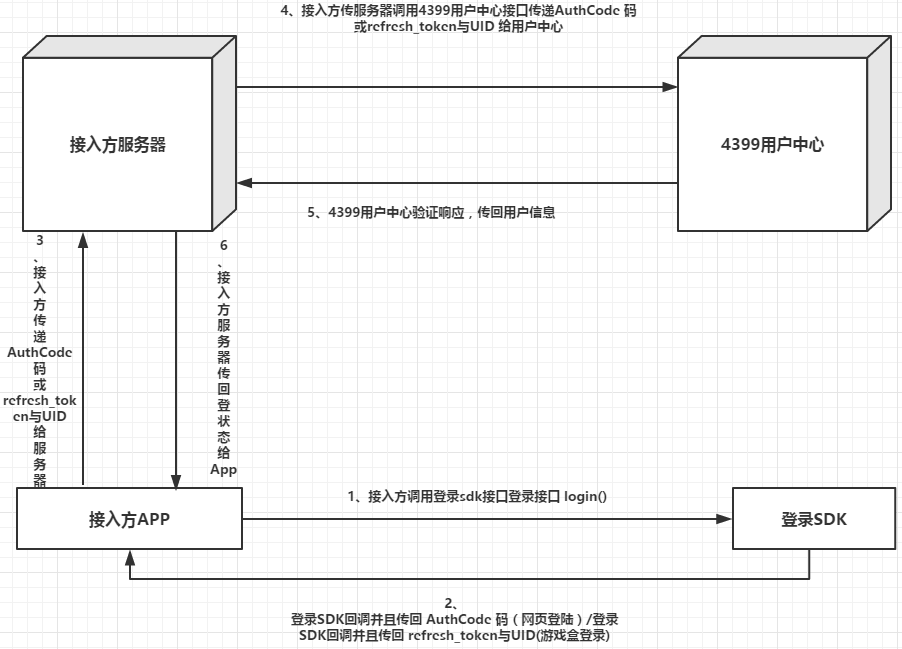


# **登录SDK2.0.0.0**
## **一、修改记录**

|   版本号   |     时间     |   修改人    |        修改内容         |
| :-----: | :--------: | :------: | :-----------------: |
| 1.2.0.0 | 2016-01-06 | Y.J.Zhou |     发布新登录sdk版本      |
| 1.2.0.1 | 2016-01-15 | Y.J.Zhou | 为配置增加redirect_url接口 |
| 1.2.0.2 | 2016-02-29  | Y.J.Zhou | 解决用户强行关闭网络权限导致的崩溃问题 |
| 1.2.0.3 | 2016-03-04  | Y.J.Zhou | 关闭未释放资源 |
| 1.2.0.4 | 2016-03-08  | Y.J.Zhou | 加入网页登陆的日志收集 |
| 2.0.0.0 | 2018-12-25  | S.C.Tu | 代码重构以及使用新设计规范 |
| 2.0.0.1 | 2018-01-31  | S.C.Tu | OpeFragmentFactory空指针处理 |


## **二、接入登录SDK**

### **1.  导入SDK依赖**

- 在需要接入SDK的android studio module下的gradle文件中加入：
``` xml
android {
    ...
    repositories {
        maven {
            url "http://mvn.4399doc.com:8081/repository/maven-releases/"
        }
    }
}
dependencies {
    // v4、v7、v13都可以，建议用最新版本
    implementation 'com.android.support:support-v4:28.0.0'
    implementation 'cn.m4399.sdk:login:2.0.0.1'
}
```


### **2.  初始化**

建议在 **Appliction** 类的 onCreate 方法中进行初始化。


``` java
public class ExampleApplication extends Application{

    @Override
    public void onCreate() {   
        super.onCreate();
        // 获取sdk操作类
        OperateCenter opeCenter = OperateCenter.getInstance();
        // sdk配置信息类
        OperateConfig opeConfig = new OperateConfig.Builder()
                // 登陆界面横竖屏配置（ 当使用游戏盒授权时，登陆强制为竖屏 ）（ 必填 ）
                .setOrientation(ActivityDemo.SCREEN_ORIENTATION)
                // app在用户中心分配的 client_id 所对应的 redirect_url（ 必填 ）
                .setRedirectUrl("http://my.4399.com")
                // app在用户中心分配的 client_id （ 必填 ）第一次接入的 APP 可自行向 4399用户中心（厦门）申请
                .setClientID("530a1a19a7e98daf50946b1ee883916a")
                // 是否全屏显示登录界面 （ 选填）如果传入false，则wap登录/注册页面是dialog的样式，传入true是全屏的样式，默认是true
                .setFullScreen(true)
                .build();


        // 进行sdk初始化（接口二）（有效防止进程被杀而导致的游戏盒无法授权登录 推荐使用）
        mOpeCenter.init(getApplicationContext(), opeConfig, new OperateCenter.ValidateListener() {
            @Override
            public void onValidateFinished(SDKResult result) {

            }
        });
    }
}

```

``` java
class SDKResult {
        // 登录接口结果码，参照（附录二）来确定是哪种登录方式
        public void getResultCode();
        // 登录接口结果
        public void getResultMsg();
        // Web 授权登录模式 AuthCode
        public void getAuthCode();
        // 游戏盒授权登录模式 refresh_token
        public void getRefreshToken();
        // 游戏盒授权登录模式 uid
        public String geUID();
}
```

### **3.  注册**

``` java
// 注册接口一经调用，无论原先是否已经登录一律清除原有登录信息，重新进行注册并且登录步骤。
mOpeCenter.register(this, new OperateCenter.ValidateListener(){
                @Override
                public void onValidateFinished(SDKResult result) {
                    Toast.makeText(getApplicationContext(), result.toString(), Toast.LENGTH_LONG).show();
                }
        });
```

### **4.  登录**

``` java
// 注册接口一经调用，无论原先是否已经登录一律清除原有登录信息，重新进行注册并且登录步骤。
mOpeCenter.login(this, new OperateCenter.ValidateListener(){
                @Override
                public void onValidateFinished(SDKResult result) {
                    Toast.makeText(getApplicationContext(), result.toString(), Toast.LENGTH_LONG).show();
                }
        });
```

### **5. 记录网页登录历史用户名**

``` java
mOpeCenter.recordAccountName(String accountName);
```

### **6. 调用结果回调**

``` java
public interface ValidateListener {
    /**
     * @param result   用户验证结果
     */
    public void onValidateFinished(SDKResult result);
}
```


## **三、代码混淆配置**

如果接入方有需要进行代码混淆，请不要混淆联编的jar包下的类，可以在proguard-rules.pro文件里追加以下配置

   ``` xml
-keep class cn.m4399.SDKResult {*;}
-keep class cn.m4399.OperateConfig {*;}
-keep class cn.m4399.OperateConfig$* {*;}
-keep class cn.m4399.OperateCenter{*;}
-keep class cn.m4399.OperateCenter$* {*;}
   ```


<p>

## **四、接入服务端接口**

### **1. 服务端接口与参数**

<p>

web授权登录

 **GET** https://ptlogin.4399.com/oauth2/token.do

<p>

| 参数名  | 内容   |
| ---- | ---- |
| grant_type=CODE | （固定字段） |
| client_id | 用户中心分配的 client_id |
| redirect_uri | 用户中心分配的 redirect_uri |
| code | Web登录获取到的 **AuthCode** |
<p>

游戏盒授权登录

 **POST** https://ptlogin.4399.com/oauth2/token.do

<p>

| 参数名  | 内容   |
| ---- | ---- |
| grant_type=TOKEN | （固定字段） |
| client_id | 用户中心分配的 client_id |
| redirect_uri | 用户中心分配的 redirect_uri |
| refresh_token | 游戏盒授权登录获取到的 **refresh_token** |


### **2.  服务端成功响应**


web授权登录

| 参数名  | 内容   |
| ---- | ---- |
| access_token | access_token |
| expired_at | accesstoken过期时间点 |
| expires_in | accesstoken有效期 |
| refresh_token | refresh_token |
| scope | 权限范围，现在都是basic |
| uid  | 用户身份识别码 |
| username | 用户名  |
| display_name | 用于显示的名字 |
| ext_nick | 第三方账号昵称 |
| bound_phone | 绑定手机号 |
| account_type | 账号类型，4399，qq，weixin，weibo |
| ext_token_expired_at | 第三方账号token过期时间点 |

游戏盒授权登录

| 参数名  | 内容   |
| ---- | ---- |
| uid  | 用户身份识别码 |
| username | 用户名  |
| scope | 权限范围，现在都是basic |
| nick | 第三方账号昵称 |
| expires_in | accesstoken有效期 |
| access_token | access_token |


### **3.  服务端失败响应**

<p>

web授权登录

``` json
{"error" : "invalid_request" , "error_description" : "Code unauthorized"}
```

游戏盒授权登录

``` json
{"error" : "invalid_request" , "error_description" : "Invalid refresh token"}
```

<p>

## **附录一、登录SDK授权步骤**

<p>



<p>

<p>

## **附录二、登录接口结果码对照表**

### **登录授权成功**

| Result_code | Result_msg |
| ----------- | ---------- |
| 0x000 | Web 登录返回 **AuthCode** 码 |
| 0x001 | Web 注册返回 **AuthCode** 码 |
| 0x002 | 游戏盒授权返回 **Refresh_Code** 与 **UID** |

### **登录授权失败**

| Result_code | Result_msg |
| ----------- | ---------- |
| 0x101 | 网页登录网络异常 |
| 0x102 | 网页注册网络异常 |
| 0x103 | 游戏盒授权无结果 |
| 0x104 | 用户取消登录 |

